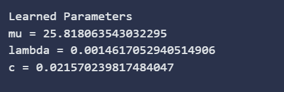
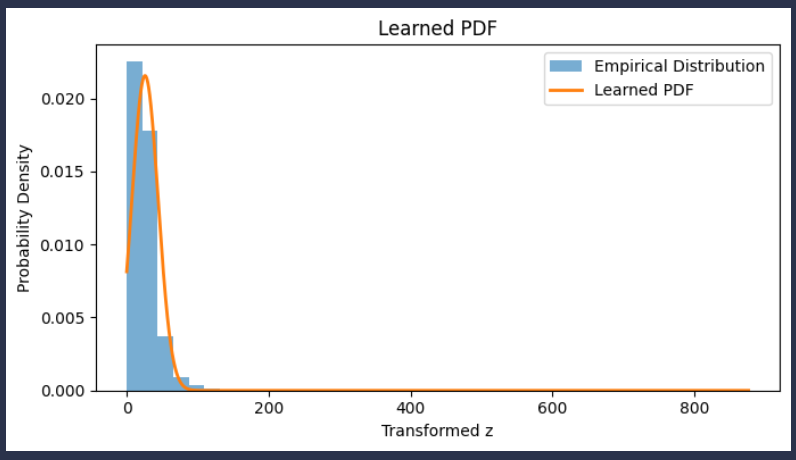

# Probability Density Estimation from NO₂ Data

## Overview
This project focuses on learning a probability density function (PDF) from real-world environmental data(using valid NO2 values from given dataset). The learned distribution is then compared with the empirical distribution derived directly from the data.

The objective is to:
- Learn distribution parameters from data
- Visually and numerically compare empirical data with the learned model

## Dataset Description
- Non-numeric and missing values are removed using coercion and filtering.

Only valid numeric NO₂ samples are used for modeling.

## Methodology
### 1. Data Preprocessing
- The `no2` column is converted to numeric values.
- Invalid entries (NaN or non-numeric values) are discarded.
- The remaining samples form the raw input variable `x`.

### 2. Transformation
Formulae:

\[
z = x + a_r*sin(b_r x)
\]

Where:
- \( a_r = 0.05 * (r mod 7) \)
- \( b_r = 0.3 * ((r mod 5) + 1) \)
- \( r \) is my roll number

### 3. Parameter Estimation
From vazriable z, the following parameters are learned:

Mean, 
Variance,
Lambda,
Normalization constant,

### 4. Learned Probability Density Function
The final PDF is modeled as:

p(z) = c · e^{−λ (z − μ)²}

## Results

### Learned Parameters

### Result Graph Explanation

The output visualization contains two components:
1. **Empirical Distribution (Histogram)**
2. **Learned Probability Density Curve**

## Key Observations
- The learned PDF closely follows the empirical distribution
- Parameters are data-driven

## Conclusion
Through this assignment, I've tried demonstrating how a probability density function can be learned from real-world data using nonlinear transformations and statistical estimation.
